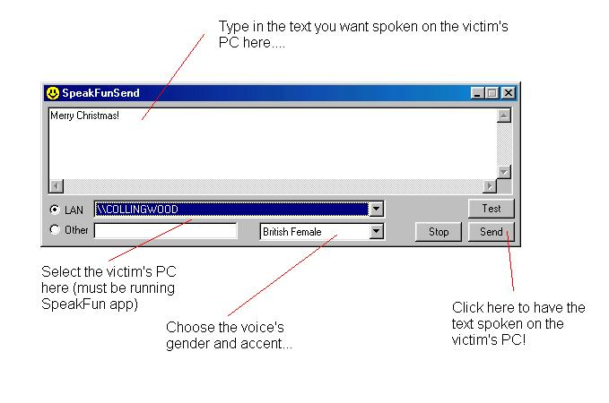



## SpeakFun \- office prank?

### Description

Here's a prank to play on other people on your network (with speakers)....

Get their machine to speak & say whatever you type into an application on your PC!

No OCXs DLLs or other rubbish needed - but the PCs must have internet access.

Have fun, and no rude words now!
 
### More Info
 

             |
---                |---
**Submitted On**   |2002-12-10 13:43:46
**By**             |[Paul Collingwood](https://github.com/Planet-Source-Code/PSCIndex/blob/master/ByAuthor/paul-collingwood.md)
**Level**          |Intermediate
**User Rating**    |4.0 (8 globes from 2 users)
**Compatibility**  |VB 5\.0, VB 6\.0
**Category**       |[Jokes/ Humor](https://github.com/Planet-Source-Code/PSCIndex/blob/master/ByCategory/jokes-humor__1-40.md)
**World**          |[Visual Basic](https://github.com/Planet-Source-Code/PSCIndex/blob/master/ByWorld/visual-basic.md)
**Archive File**   |[SpeakFun\_\-15114712112002\.zip](https://github.com/Planet-Source-Code/paul-collingwood-speakfun-office-prank__1-41466/archive/master.zip)

